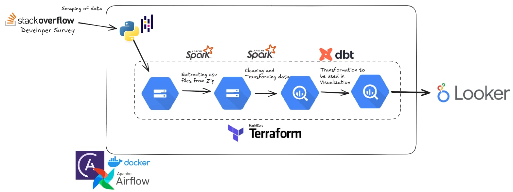

# Stack Overflow End-to-End Data Pipeline

## Objective

This project demonstrates an end-to-end data pipeline for processing and analyzing the Stack Overflow Developer Survey data from 2011 to 2024. It uses modern data engineering tools and practices.

You can check the source of data here: [https://survey.stackoverflow.co/](https://survey.stackoverflow.co/)


---
## 💭 Problem Statement

This project analyzes 14 years of Stack Overflow Developer Survey data to uncover valuable insights into technology trends, developer experiences, and industry shifts. The analysis covers a wide range of topics, including programming languages, salary distribution, education demographics, job roles, and predictions for future tech trends.

### Key Insights:

1. **Technology Trends**:
   - Track the evolution of programming language popularity over time.
   - Identify regional differences in tech adoption and usage trends across different countries and regions over the past 14 years.

2. **Salary Insights**:
   - Examine salary distribution based on factors such as skills, years of experience, and geographical location.
   - Explore top-paying technologies and analyze gender pay gaps within the developer community.

3. **Educational Demographics**:
   - Analyze the education levels of developers to understand the relationship between educational background and career progression in tech.

4. **Occupation Breakdown**:
   - Gain insights into the diverse job roles within the tech industry, including developers, data scientists, product managers, and other tech professionals.
   - Explore how occupation types have evolved over time and their geographical distribution.

5. **Future Tech Predictions**:
   - Use historical data to identify emerging technology trends, examining patterns in adoption and analyzing failures.
   - Predict the next wave of popular technologies and methodologies based on past survey data and usage trends.
---


## 🚀 Pipeline Overview




1. **Data Ingestion**  
   - Scrape Stack Overflow Developer Survey data using Python.  
   - Upload raw ZIP files into Google Cloud Storage (GCS).

2. **Data Processing**  
   - Extract CSV files from ZIP archives stored in GCS using PySpark.  
   - Clean and transform the extracted data.

3. **Data Loading**  
   - Load the cleaned and transformed data into BigQuery.

4. **Data Modeling**  
   - Use dbt to perform additional transformations for analytics and visualization.

5. **Visualization**  
   - Visualize the final dataset using Looker.

6. **Orchestration**  
   - Manage the entire workflow using Apache Airflow running on Docker.

7. **Infrastructure**  
   - Provision GCS buckets and BigQuery datasets/tables using Terraform.

---

## Dashboard


You can check the dashboard here: [Stack Overflow Annual Developer's Survey Analysis](https://lookerstudio.google.com/reporting/8506c4f0-3b8e-4fe3-bdd8-364414e2f600)

---

## 🗂 Project Structure

```
.
├── dags/
│   ├── dbt_dag.py
│   ├── main_dags.py
│   └── web_to_gs_pipeline.py
├── dbt_pipeline/
│   ├── analyses/
│   ├── dbt_packages/
│   ├── logs/
│   ├── macros/
│   ├── models/
│   ├── seeds/
│   ├── snapshots/
│   ├── target/
│   ├── dbt_project.yml
│   ├── package-lock.yml
│   ├── packages.yml
│   └── README.md
├── include/
│   ├── final_transformation.py
│   ├── gcs_extract_upload.py
│   ├── pulling_bqquery_transform.py
│   ├── scraper.py
│   └── transform_and_upload_bigquery.py
├── images/
├── logs/
├── terraform/
│   └── (main.tf, variables.tf, etc.)
├── transforms/
├── .astro/
├── .env
├── .gitignore
├── airflow_settings.yaml
├── docker-compose.override.yml
├── Dockerfile
├── my-credentials.json
├── packages.txt
├── README.md
├── requirements.txt
```
### Quick Summary:

- **Airflow (`dags/`)**: Defines how and when the entire pipeline is triggered.
- **dbt (`dbt_pipeline/`)**: Handles SQL transformations inside BigQuery.
- **Python scripts (`include/`)**: Scraping, extracting, cleaning, and uploading.
- **Terraform (`terraform/`)**: Infrastructure as code to automate resource creation.
- **Docker & configs**: Makes everything containerized and easy to run.
- **Documentation (`images/`, `README.md`)**: Assets and guides to help understand and use the project.

---

## 🛠️ Technologies Used

- **Python**: Core language for data extraction, transformation, and loading (ETL) scripts.
- **Docker**: Containerizes the Airflow environment and dbt transformations.
- **Apache Airflow**: Manages and schedules data pipeline workflows.
- **dbt (Data Build Tool)**: Models and transforms data inside BigQuery.
- **Terraform**: Provisions GCS buckets and BigQuery datasets/tables as infrastructure.
- **Google Cloud Storage (GCS)**: Stores raw, cleaned, and transformed data files.
- **Google BigQuery**: Hosts final structured datasets ready for analytics.
- **PySpark**: Cleans and standardizes raw survey data across multiple years.
- **Pandas**: Used for lightweight transformations and quick data manipulations where appropriate.


---

## ⚙️ Setup Instructions

### 1. Clone the Repository

```bash
git clone https://github.com/cancinoray/stackoverflow-data-pipeline
cd stackoverflow-data-pipeline
```

### 2. Create `.env` File

```env
GOOGLE_APPLICATION_CREDENTIALS=./my-credentials.json
PROJECT_ID=your-gcp-project-id
GCS_BUCKET=your-gcs-bucket-name
BQ_DATASET=your-bigquery-dataset
```

### 3. Install necessary technology
- Install[ docker-compose](https://docs.docker.com/compose/install/)
- Install [Terraform](https://developer.hashicorp.com/terraform/install#linux)
- Install [dbt-core](https://docs.getdbt.com/docs/core/installation-overview)
   ```bash
   pip install dbt-bigquery
   ```
### 4: Create a service account
>Create a project and a service account on Google Cloud with these permissions:
- BigQuery Admin
- Storage Admin
- Storage Object Admin
- Compute Admin
  
Download the Service Account JSON file, rename it to `my-credentials.json` store it in the root directory

Also, make sure to activate these APIs:

- https://console.cloud.google.com/apis/library/iam.googleapis.com
- https://console.cloud.google.com/apis/library/iamcredentials.googleapis.com

### 5. Provision Infrastructure with Terraform

```bash
cd terraform
terraform init
terraform apply
```

### 6. Start Airflow with Docker Compose (Using Astronomer)

```bash
astro dev start
```

### 7. Initialize and Set Up dbt

```bash
cd dbt_pipeline
dbt deps          # Install dbt packages
dbt run           # Run transformation models
```

### 8. Access Airflow

Visit `http://localhost:8080` and use:

- **Username**: `admin`
- **Password**: `admin` (default)

Trigger the `stackoverflow_end_to_end_dag` DAG to run the pipeline.

### 9. Create connections in Airflow UI
   - Click `Admin` and then select `Connections`
   - Click the blue button saying `Add a new record`
   - For `bigquerry_conn`
     - **Connection Id**: bigquery_conn
     - **Connection Type**: Google Bigquery
     - **Project Id**: Enter the GCP Project Id
     - **Keyfile Path**: /usr/local/airflow/gcloud/application_default_credentials.json
     - **Location**: Enter the GCP Project Location
   - For `my_spark_conn`
     - **Connection Type**: Spark
     - **Host**: spark://spark-master
     - **Port**: 7077
     - **Deploy mode**: client
     - **Spark binary**: spark-submit

---

## 🔄 DAG Workflow

- `main_dags.py`:
  - Download or scrape data
  - Upload to GCS
  - Transform using PySpark
  - dbt for data modeling
  - Load clean data to BigQuery

---

## 🔐 Security

- Add `my-credentials.json` to your `.gitignore`
- Do not commit any sensitive information

---

## 🙌 Acknowledgements

Inspired by the [DataTalksClub Data Engineering Zoomcamp](https://github.com/DataTalksClub/data-engineering-zoomcamp).